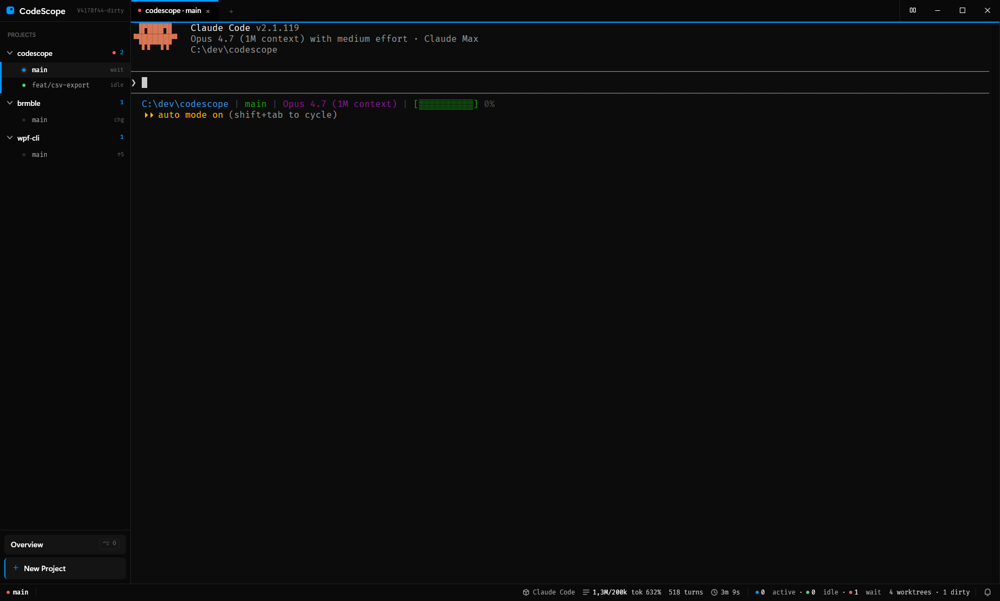
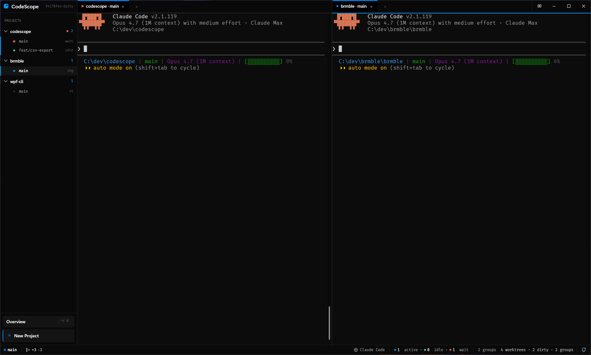
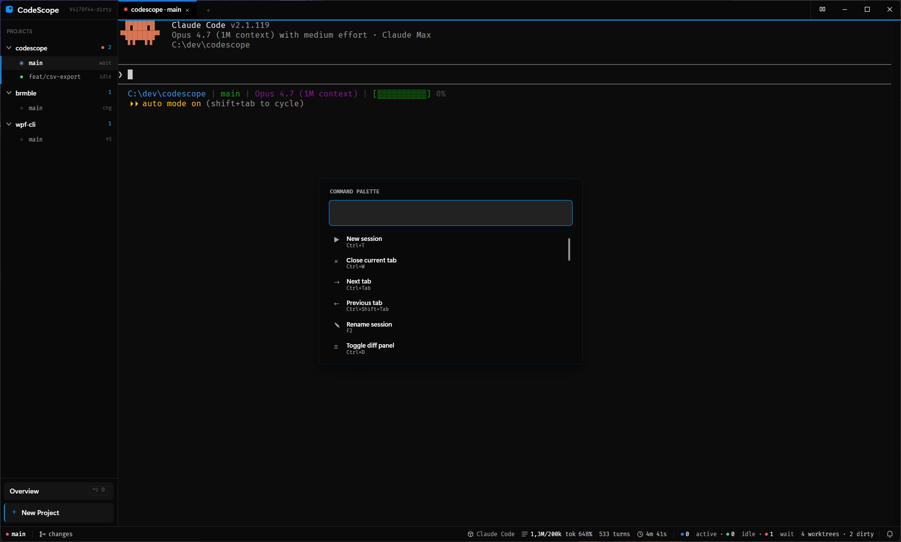
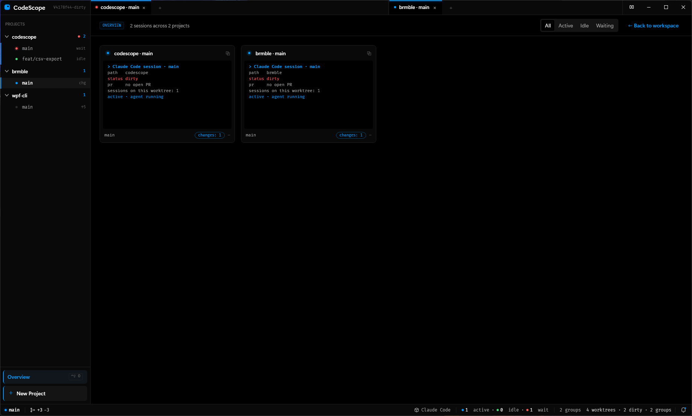
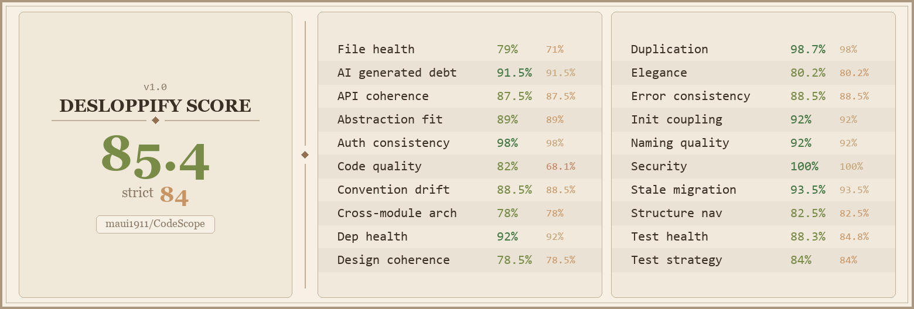

# CodeScope

**A native command center for AI coding agents.**

CodeScope runs Claude Code, Codex, Copilot, OpenCode, Pi and any other CLI agent as parallel, worktree-isolated sessions inside a single window — with tabbed terminals, split editor groups, a live git overview, and a keyboard-first command palette. Ships on Windows, macOS (Apple Silicon + Intel), and Linux x64.



---

## Why

Agents are fast enough that one at a time is now the bottleneck. Running five parallel `claude` sessions from a plain terminal means juggling five shells, five branches, and five mental stacks. CodeScope gives each agent its own git worktree, its own tab, its own notification status, and surfaces the state of every session at a glance:

- **Worktree isolation** — every session starts with `git worktree add -b` under the hood, so agents never step on each other's branches.
- **Native** — Rust + [GPUI](https://www.gpui.rs/) chrome, ConPTY/PTY-backed terminals via the in-tree `codescope-terminal` crate. No Electron, no WebView2.
- **Bring your own agent** — anything on `PATH` works: `claude`, `codex`, `opencode`, raw `pwsh` / `bash`. Zero translation layer.

## Features

### Split editor groups

Snap a worktree into its own workspace with `Ctrl+\`. Two agents, side by side, each with their own terminal and tab strip.



### Command palette

`Ctrl+K` / `Ctrl+Shift+P` opens the palette. Every menu action is keyboard-reachable — no mouse required for the common paths.



### Overview

`Ctrl+Shift+O` flips the workspace into a grid view: every worktree across every project, with its active sessions, dirty state, open PR and CI status at a glance. Filter by `Active` / `Idle` / `Waiting` to find the agent that needs your attention.



### Paste screenshots straight into the prompt

`Ctrl+V` of a clipboard image stores the bytes under `<worktree>/.codescope/attachments/<timestamp>-<hash>.<ext>` and pastes the slash-normalized relative path into the focused terminal — so any agent that accepts a file path (Claude, Codex, OpenCode, …) ingests it without you switching to a file dialog. The path is git-ignored automatically via `.git/info/exclude`, so screenshots don't leak into commits.

### Themes

Six built-ins selectable from the settings dialog (`Ctrl+Shift+,`): `codescope-default`, `vs-code-dark`, `one-dark`, `solarized-dark`, `tokyo-night`, `light`. Live-applied to chrome and the in-tree terminal. Persisted as the `theme` key in `settings.json`, so hand-editing works too.

### Also in the box

- **Sidebar tree** — Projects → Worktrees → Sessions, drag-and-drop to add a project, F2 to rename.
- **Per-tab Claude telemetry** — turns, last-activity, context-window usage pulled straight from the `~/.claude/projects` JSONL tail.
- **Pull-request awareness** — GitHub and Gitea, polled on a back-off, CI rollup on each worktree row.
- **Notifications deck** — agent "waiting on user" states surface as Windows toasts; unread counter in the status bar.
- **Multi-pane layout persisted** — groups, tabs, widths, focus — all restored on restart.

## Install

Grab the latest release from the [**Releases page**](https://github.com/maui1911/CodeScope/releases/latest). Pick the asset that matches your machine:

| Asset | Platform |
|---|---|
| **`CodeScope-vX.Y.Z-setup.exe`** | Windows 10 22H2+ / Windows 11 (x64) — Inno Setup installer, per-user, no UAC. Installs to `%LOCALAPPDATA%\Programs\CodeScope`. |
| **`CodeScope-vX.Y.Z-aarch64-apple-darwin.tar.gz`** | macOS 13+ on Apple Silicon — extract and drag to `/Applications`. |
| **`CodeScope-vX.Y.Z-x86_64-apple-darwin.tar.gz`** | macOS 13+ on Intel — extract and drag to `/Applications`. |
| **`CodeScope-vX.Y.Z-x86_64-unknown-linux-gnu.tar.gz`** | Linux x64 — extract and run `./codescope`. |

> **Upgrading from a `codescope-rs` build (v0.3.0 or earlier):** uninstall `codescope-rs` from *Add/Remove Programs* before running the new `CodeScope-setup.exe`. Your projects, layout, and settings (in `%APPDATA%\CodeScope\`) carry over unchanged.

### Requirements

- `git` on `PATH`
- At least one agent CLI on `PATH` (`claude`, `codex`, `copilot`, `opencode`, `pi`, etc.)
- **Windows only:** PowerShell 7+ (`pwsh.exe`) on `PATH`. CodeScope spawns `pwsh.exe` for every terminal tab and for the `-Command "& { <agent> }"` wrapper that auto-types the agent CLI — legacy `powershell.exe` (Windows PowerShell 5.1) is not used. Override with the `CODESCOPE_SHELL` env var if you want a different shell.

> **No Rust toolchain needed** — the release is self-contained.

## Build from source

Only needed if you want to contribute or hack on CodeScope itself.

```pwsh
# Prerequisites: stable Rust toolchain (1.85+, edition 2024), git
cargo build --workspace
cargo run --bin codescope
```

Run the tests:

```pwsh
cargo test --workspace
```

Build a release binary:

```pwsh
cargo build --workspace --release
```

For installer packaging see `installer/CodeScope.iss` and `.github/workflows/release.yml`.

## Keyboard shortcuts

| | |
|-|-|
| `Ctrl+T` | New session in focused group |
| `Ctrl+W` | Close tab (twice to collapse an empty group) |
| `Ctrl+\` | Split the focused group right |
| `Alt+←` / `Alt+→` | Cycle focus between groups |
| `Ctrl+Tab` / `Ctrl+Shift+Tab` | Next / previous tab |
| `Ctrl+1`…`Ctrl+9` | Jump to tab by index |
| `Ctrl+K`, `Ctrl+Shift+P` | Command palette |
| `Ctrl+Shift+,` | Open settings (theme, font, cursor, default agent) |
| `Ctrl+Shift+O` | Toggle overview |
| `Ctrl+F` | Focus sidebar filter |
| `Ctrl+Shift+Enter` | Open selected worktree in a new group |
| `F2` | Rename session / worktree |
| `F5` | Refresh all |

## Repository layout

```
src/             GPUI application shell — AppShell, MainViewModel, dialogs, views
core/            Pure logic — services, models, no UI references
terminal/        GPUI-native ConPTY/PTY terminal view (codescope-terminal crate)
examples/        Standalone GPUI demos
assets/          Icons, fonts, packaged resources
wix/             Windows installer chrome
scripts/         Release / packaging helpers
vendor/          Vendored upstream crates
docs/
  DESIGN.md      Design tokens
  DECISIONS.md   ADRs
  HANDOFF.md     Rolling cursor between working sessions
  MIGRATION-csharp-to-rust.md  Historical note on the 2026-05-14 cutover
  screenshots/   README imagery
Cargo.toml       Workspace root + the `codescope` binary crate
```

> Historical note: through `v0.2.6` the canonical tree was a .NET 10 / WPF
> build at `src/CodeScope.{App,Core,Ui}/`, and the Rust port lived under
> `codescope-rs/`. The C# tree is preserved at tag `legacy/v0.2.6-final`;
> the Rust port was flattened to repo root in cutover-3. See
> [docs/MIGRATION-csharp-to-rust.md](docs/MIGRATION-csharp-to-rust.md)
> for the why and how of the cutover.

## Status

Pre-1.0. The core session / worktree / PR workflows are stable and used daily. The C# implementation was retired in `v0.3.0`; see `docs/MIGRATION-csharp-to-rust.md`.

See `docs/HANDOFF.md` for the live status cursor and `docs/DECISIONS.md` for the architectural record.

### Code health



Scored by [desloppify](https://github.com/peteromallet/desloppify).

## Contributing

- Conventional commits (`feat:`, `fix:`, `chore:`, `refactor:`, `test:`, `docs:`).
- Read `CLAUDE.md` and `docs/DECISIONS.md` before proposing architecture changes.
- PRs / issues / code / comments in English.

## License

[**FSL-1.1-ALv2**](LICENSE) — Functional Source License, Version 1.1, with Apache 2.0 future grant.

You can read, fork, self-host, and contribute today. Commercial use that competes with CodeScope is restricted while the license is active; each release automatically converts to Apache 2.0 two years after it's published.
